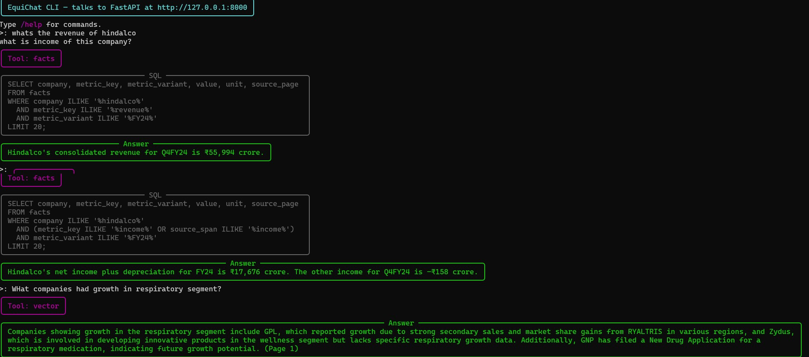

# EquiChat: AI-Powered Financial PDF Analysis

**EquiChat** is a sophisticated financial document analysis system that extracts comprehensive metrics from equity research reports and financial PDFs using OpenAI's advanced language models. Built for scalability and accuracy, it provides both programmatic APIs and an interactive chat interface for querying financial data.




## 🚀 Features

### Core Capabilities
- **📊 Comprehensive Data Extraction**: Extracts ALL financial metrics from PDFs using GPT-5/GPT-4o
- **🔍 Multi-Modal Analysis**: Processes both tables and text with intelligent parsing
- **💬 Natural Language Queries**: Chat interface for asking questions like "What is Hindalco's revenue in FY24?"
- **🎯 Structured Extraction**: Converts unstructured PDFs into queryable facts database

### Advanced Features
- **🔄 Batch Processing**: Parallel PDF ingestion with smart deduplication
- **🌐 REST API**: FastAPI-based web service for integration
- **💾 Storage**: DuckDB for fast analytical queries
- **🔍 Vector Search**: Semantic search across document content

## 🏗️ Architecture

EquiChat consists of **two main components**:

### Part 1: Ingestion Pipeline
Processes PDFs and stores data in dual formats for different query types.

```
┌─────────────────┐    ┌──────────────────┐    ┌─────────────────────┐
│   PDF Files     │───▶│  OpenAI GPT-5    │───▶│  Structured Facts   │
│ (Equity Reports)│    │   Extraction     │    │   (DuckDB Tables)   │
└─────────────────┘    └──────────────────┘    └─────────────────────┘
         │                       │
         │                       ▼
         │              ┌─────────────────────┐
         └─────────────▶│  Vector Embeddings  │
                        │   (FAISS Index)     │
                        └─────────────────────┘
```

### Part 2: Query Engine
Routes queries to appropriate data sources based on query type.

```
┌─────────────────┐    ┌──────────────────┐    ┌─────────────────────┐
│   Chat UI       │───▶│   Smart Router   │───▶│  Structured Facts   │
│ Natural Language│    │  Query Engine    │    │     (SQL Query)     │
└─────────────────┘    └──────────────────┘    └─────────────────────┘
                                │
                                ▼
                       ┌─────────────────────┐
                       │  Vector Search      │
                       │ (Semantic Retrieval)│
                       └─────────────────────┘
```

### Key Components

#### Part 1: Ingestion Pipeline
1. **PDF Processing** (`src/equichat/ingest.py`)
   - OpenAI GPT-5 extraction with structured prompts
   - Fallback to traditional table/text parsing
   - Intelligent unit normalization and confidence scoring

2. **Dual Storage System**
   - **Structured Facts** (`src/equichat/store.py`): DuckDB tables for metrics, ratios, financial data
   - **Vector Index** (`src/equichat/vector_store.py`): FAISS embeddings for semantic text search

#### Part 2: Query Engine
3. **Smart Router** (`src/equichat/router.py` & `src/equichat/router_llm.py`)
   - **Query Classification**: Determines if query needs structured data or semantic search
   - **Intent Detection**: Metrics lookup vs. text-based questions
   - **Route Selection**: SQL queries vs. vector similarity search

4. **Query Execution**
   - **Structured Queries** (`src/equichat/facts_query.py`): SQL generation for metrics/ratios
   - **Semantic Search** (`src/equichat/vector_search.py`): FAISS retrieval for contextual questions

5. **API Server** (`scripts/api.py`)
   - FastAPI-based REST endpoints
   - File upload and processing
   - Real-time query handling via router

## 📦 Installation

### Prerequisites
- Python 3.9+
- OpenAI API key
- (Optional) uv for fast dependency management

### Setup

1. **Clone the repository**
   ```bash
   git clone <repository-url>
   cd answer_chatbot
   ```

2. **Install dependencies**
   ```bash
   # Using uv (recommended)
   uv pip install -r requirements.txt

   # Or using pip
   pip install -r requirements.txt
   ```

3. **Set environment variables**
   ```bash
   export OPENAI_API_KEY="your-openai-api-key"
   export EQUICHAT_DB_PATH="./data/equichat.duckdb"
   export EQUICHAT_OPENAI_MODEL="gpt-5"  # or gpt-4o-mini for cost efficiency
   ```

## 🎯 Quick Start

### 1. Ingest Financial PDFs

**Traditional document ingestion:**
```bash
# Ingest documents with legacy parsing (fast, less comprehensive)
uv run python scripts/ingest_documents.py data --ignore-last-page
```

**OpenAI-powered extraction (recommended):**
```bash
# Single PDF with caching
python scripts/ingest_batch.py --folder ./data --limit 1

# Process multiple PDFs in parallel
python scripts/ingest_batch.py \
  --folder ./data \
  --limit 10 \
  --workers 3 \
  --cache-dir ./cache/extractions

# High-performance batch ingestion (recommended)
uv run python scripts/ingest_batch.py \
  --folder data \
  --workers 20 \
  --limit 20 \
  --force \
  --cache-dir ./my_cache
```

### 2. Build Search Index (Optional)

```bash
# Build FAISS vector index for semantic search
uv run python - <<'PY'
from equichat.vector_search import build_faiss_from_duckdb
print(build_faiss_from_duckdb(out_dir="./data/vec_index"))
PY
```

### 3. Start the API Server

```bash
# Start FastAPI server
python scripts/api.py

# Or with auto-reload for development
EQUICHAT_RELOAD=true python scripts/api.py
```

### 4. Query Your Data

**Interactive chat interface:**
```bash
# Start chat interface
python scripts/chat.py
```

**Direct LLM queries:**
```bash
# Query using LLM router (recommended for testing)
uv run python scripts/query_llm.py "What are all the companies in bangalore?"
```

### REST API

```bash
# Upload and process PDF
curl -X POST "http://localhost:8000/ingest" \
  -F "file=@financial_report.pdf" \
  -F "company_hint=Company Name"

# Query extracted data
curl -X POST "http://localhost:8000/query" \
  -H "Content-Type: application/json" \
  -d '{"query": "What is Hindalco revenue in FY24?"}'

# List all extracted facts
curl "http://localhost:8000/facts?limit=100"
```

## 🛠️ Configuration

### Environment Variables

| Variable | Default | Description |
|----------|---------|-------------|
| `OPENAI_API_KEY` | *required* | OpenAI API key for extraction |
| `EQUICHAT_DB_PATH` | `:memory:` | DuckDB database path |
| `EQUICHAT_OPENAI_MODEL` | `gpt-5` | Model for extraction |
| `EQUICHAT_USE_OPENAI_EXTRACTION` | `true` | Enable OpenAI extraction |
| `EQUICHAT_CONFIDENCE_THRESHOLD` | `0.7` | Min confidence for results |
| `EQUICHAT_API_HOST` | `0.0.0.0` | API server host |
| `EQUICHAT_API_PORT` | `8000` | API server port |

### Configuration File

Create `.env` file in project root:
```bash
OPENAI_API_KEY=your-key-here
EQUICHAT_DB_PATH=./data/equichat.duckdb
EQUICHAT_OPENAI_MODEL=gpt-5
EQUICHAT_USE_OPENAI_EXTRACTION=true
EQUICHAT_IGNORE_LAST_PAGE=true
```

## 📁 Project Structure

```
answer_chatbot/
├── src/equichat/                 # Core library
│   ├── config.py                # Configuration management
│   ├── store.py                 # Database layer (DuckDB)
│   ├── ingest.py                # PDF processing & extraction
│   ├── router.py                # Query routing & NLU
│   ├── tools.py                 # Query execution tools
│   ├── schemas.py               # Data models
│   ├── facts_query.py           # SQL query builders
│   ├── router_llm.py            # LLM-based routing
│   └── vector_store.py          # Vector search (optional)
├── scripts/                     # CLI tools & servers
│   ├── ingest_batch.py          # Batch PDF processing
│   ├── api.py                   # FastAPI server
│   ├── chat.py                  # Interactive chat interface
│   ├── extract_with_openai.py   # Direct OpenAI extraction
│   └── query_llm.py             # LLM query testing
├── data/                        # Data directory
│   ├── equichat.duckdb          # Main database
│   └── *.pdf                    # Source PDFs
├── cache/                       # Extraction cache
│   └── extractions/             # Cached OpenAI results
├── tests/                       # Test suite
└── requirements.txt             # Python dependencies
```

## 🎛️ Advanced Usage

### Custom Extraction Schemas

Modify the extraction schema in `src/equichat/ingest.py` to capture specific metrics:

```python
# Add custom metrics to the extraction prompt
CUSTOM_METRICS = {
    "working_capital": ["working capital", "net working capital"],
    "capex": ["capital expenditure", "capex", "capital investments"],
    "free_cash_flow": ["free cash flow", "fcf"],
}
```

## 🔍 Dual Query System

EquiChat intelligently routes queries to the appropriate data source:

### Structured Data Queries → DuckDB (SQL)
**Metrics, ratios, financial calculations:**
- "What is Hindalco's revenue in FY24?" → `SELECT value FROM facts WHERE company='Hindalco' AND metric_key='revenue'`
- "Top 5 banks by market cap" → `SELECT company, value FROM facts WHERE industry='Banking' ORDER BY value DESC`
- "Companies with ROE > 15%" → `SELECT company FROM facts WHERE metric_key='roe' AND value > 15`

### Semantic Text Queries → FAISS (Vector Search)
**Explanatory, contextual, qualitative questions:**
- "Why did Hindalco's margins improve?" → Vector search through earnings call transcripts
- "What are the key risks for pharmaceutical companies?" → Semantic retrieval from risk sections
- "Explain the company's growth strategy" → Text similarity matching in management commentary

### Supported Query Types

#### Structured Data (DuckDB)

#### Semantic Search (FAISS)

## 🐛 Troubleshooting

### Common Issues

1. **OpenAI API Errors**
   ```bash
   # Check API key
   echo $OPENAI_API_KEY

   # Test API access
   curl -H "Authorization: Bearer $OPENAI_API_KEY" \
        https://api.openai.com/v1/models
   ```

2. **Database Connection Issues**
   ```bash
   # Check database path
   ls -la ./data/equichat.duckdb

   # Reset database
   rm ./data/equichat.duckdb
   ```

3. **Extraction Quality Issues**
   - Try different models: `gpt-5` > `gpt-4o` > `gpt-4o-mini`
   - Increase confidence threshold in config
   - Check PDF quality (text-based vs scanned)

### Performance Optimization


1. **Parallel Processing**
   ```bash
   # Increase workers for CPU-bound tasks
   python scripts/ingest_batch.py --workers 8
   ```

## 🤝 Contributing

1. **Fork the repository**
2. **Create feature branch**: `git checkout -b feature/amazing-feature`
3. **Add tests**: `pytest tests/`
5. **Submit pull request**

### Development Setup

```bash
# Install development dependencies
pip install -r requirements.txt

# Run tests
pytest tests/ -v

```

## 📄 License

This project is licensed under the MIT License - see the [LICENSE](LICENSE) file for details.

## 🙏 Acknowledgments

- OpenAI for powerful language models
- DuckDB for fast analytical database
- FastAPI for modern web framework
- Rich for beautiful CLI interfaces
- OpenAI/Cluade/Gemini for patches to the code


---
